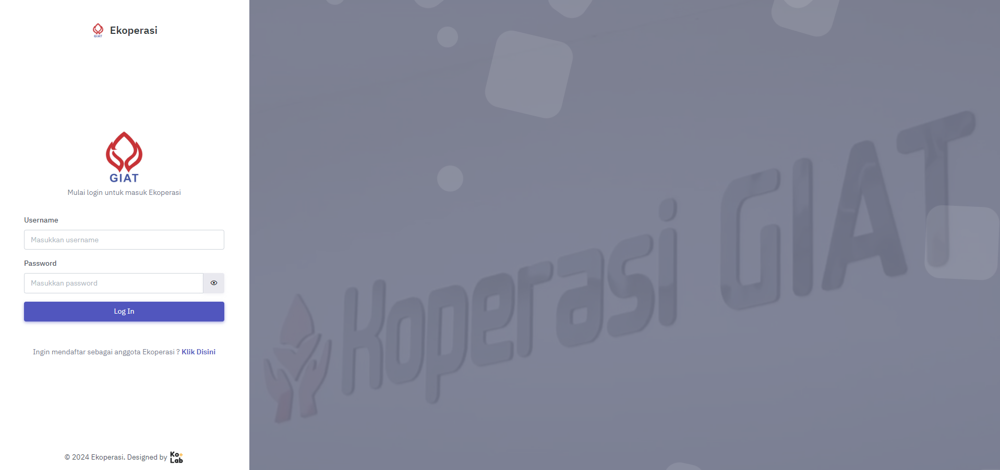
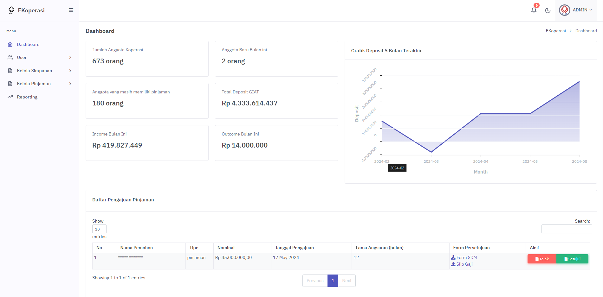

# E-Koperasi

**E-Koperasi** adalah aplikasi web koperasi online yang dibangun menggunakan CodeIgniter4. Aplikasi ini menyediakan berbagai fitur untuk memudahkan pengelolaan koperasi dengan empat tipe pengguna: Ketua, Bendahara, Admin, dan Anggota. 

## Skema Database
Aplikasi ini menggunakan database yang dirancang secara khusus untuk memenuhi kebutuhan pengelolaan koperasi, dengan berbagai tabel yang saling berelasi untuk memastikan integritas data.

## Fitur Utama
Aplikasi ini menawarkan fitur-fitur lengkap yang disesuaikan dengan peran pengguna:

### Admin
- **Dashboard Informatif:** Menyediakan data dan informasi penting secara real-time.
- **Kelola User:** CRUD (Create, Read, Update, Delete) untuk manajemen pengguna.
- **Kelola Simpanan Anggota:** Proses pengajuan simpanan koperasi (terima/tolak).
- **Kelola Pinjaman:** Proses pengajuan pinjaman koperasi (terima/tolak).
- **Generate Laporan:** Membuat laporan keuangan dan aktivitas koperasi.
- **Cetak Laporan:** Cetak laporan dalam format yang diinginkan.

### Ketua
- **Dashboard Informatif:** Mengawasi kondisi koperasi dengan informasi terbaru.
- **Kelola Pinjaman:** Mengelola proses pengajuan pinjaman (terima/tolak).
- **Cetak Laporan:** Print laporan untuk kebutuhan dokumentasi.

### Bendahara
- **Dashboard Informatif:** Memantau arus kas dan transaksi keuangan.
- **Kelola Simpanan Anggota:** Mengelola simpanan manasuka dan otomatis anggota.
- **Kelola Pinjaman:** Mengelola pengajuan pinjaman (terima/tolak).
- **Kelola Parameter Keuangan:** Mengatur cutoff, bunga, dan provisi bulanan.
- **Generate Laporan:** Membuat laporan keuangan dengan parameter yang disesuaikan.
- **Cetak Laporan:** Print laporan keuangan dan lainnya.

### Anggota
- **Dashboard Informatif:** Menyediakan gambaran umum tentang simpanan dan pinjaman.
- **Edit Profil:** Mengelola dan memperbarui informasi pribadi.
- **Kelola Simpanan:** Ajukan simpanan manasuka atau simpanan otomatis bulanan.
- **Kelola Pinjaman:** Ajukan pinjaman dan kelola pembayaran cicilan.

## Rekomendasi Kebutuhan Sistem
Agar aplikasi ini dapat berjalan dengan baik, berikut adalah kebutuhan sistem yang direkomendasikan:

- Composer - Dependency Manager untuk PHP. ([Download Composer](https://getcomposer.org/download/))
- MySQL 5.7 - Database server yang kompatibel. ([Download MySQL 5.7](https://dev.mysql.com/downloads/mysql/5.7.html))
- PHP 7.4 - Versi PHP yang didukung oleh CodeIgniter 4. ([Download PHP 7.4](https://www.php.net/downloads))

## Instalasi
Ikuti langkah-langkah berikut untuk menjalankan proyek ini di lingkungan lokal Anda:

1. Clone repositori ini: `git clone https://github.com/egn234/ekoperasi.git`
2. Masuk ke direktori proyek: `cd ekoperasi`
3. Install dependencies menggunakan Composer: `composer install`
4. Copy file env menjadi .env: `cp env .env`
5. Sesuaikan pengaturan database di file `.env` Anda sesuai dengan konfigurasi lokal Anda.
6. Jalankan server lokal: `php spark serve`

### Import Database
Untuk mengimpor skema database, silakan gunakan file SQL yang telah disediakan di direktori berikut:

`app/database/ekoperasi_clean.sql`

---

> Proyek ini terus diperbarui untuk memastikan kinerja optimal dan penambahan fitur baru sesuai dengan kebutuhan pengguna. Jika Anda memiliki saran atau menemukan masalah, jangan ragu untuk membuka *issue* atau *pull request*.
