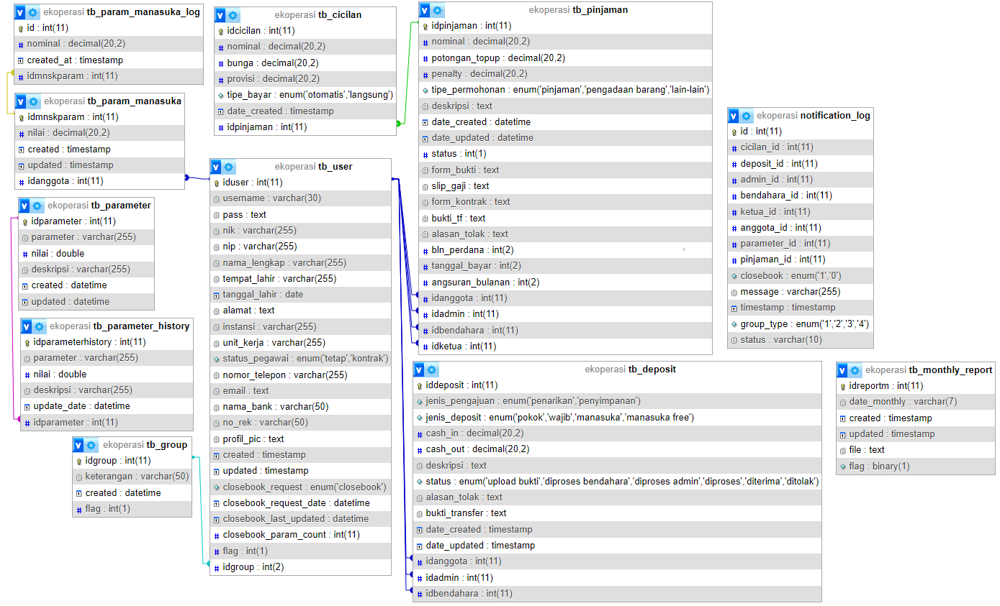

# E-Koperasi

Web App Koperasi online dengan native CodeIgniter4. terdiri dari 4 user yaitu ketua, bendahara, admin, dan anggota. 


## Skema Database


## Fitur
### Admin
- Informative Dashboard
- Kelola User (CRUD)
- Kelola Simpanan Anggota (terima/tolak pengajuan simpanan koperasi manasuka)
- Kelola Pinjaman (terima/tolak pengajuan pinjaman)
- Generate Report
- Print Report

### Ketua
- Informative Dashboard
- Kelola Pinjaman (terima/tolak pengajuan pinjaman)
- Print Report

### Bendahara
- Informative Dashboard
- Kelola Simpanan Anggota (terima/tolak pengajuan simpanan koperasi manasuka)
- Kelola Pinjaman (terima/tolak pengajuan pinjaman)
- Kelola Parameter untuk cutoff/bunga/provisi bulanan 
- Generate Report
- Print Report

### User 
- Informative Dashboard
- Profile Editing
- Kelola Simpanan (pengajuan simpanan manasuka, simpanan otomatis bulanan)
- Pinjaman (pengajuan pinjaman, bayar cicilan)

## Rekomendasi Kebutuhan
- [Composer](https://getcomposer.org/download/)
- [MySQL 5.7](https://dev.mysql.com/downloads/mysql/5.7.html)
- [PHP 7.4](https://www.php.net/downloads)

## Instalasi
Langkah-langkah untuk menjalankan proyek ini secara lokal:

```bash
# Clone repositori ini
git clone https://github.com/username/ekoperasi.git

# Masuk ke direktori proyek
cd ekoperasi

# Install dependencies menggunakan Composer
composer install

# Copy file env menjadi .env
cp env .env

# Jalankan server lokal
php spark serve

```

### Import Database
Untuk mengimpor skema database, file sql berada di ```app/database/ekoperasi_clean.sql```